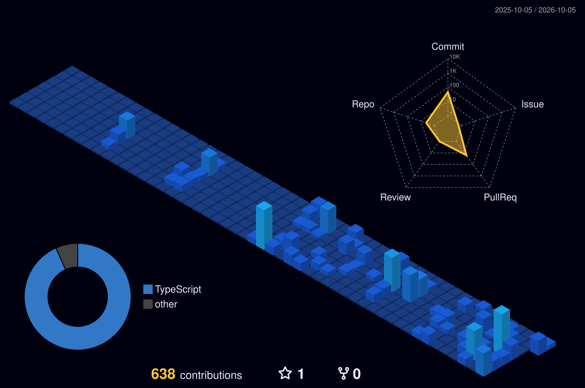

```typescript
//  ____  _____ _______        _______ ____
// |  _ \|_ _|__  /\ \      / / ____| __ )
// | | | || |  / /  \ \ /\ / /|  _| |  _ \      Creative Solutions
// | |_| || | / /_   \ V  V / | |___| |_) |     Web · Apps · Hosting · Automation
// |____/|___/____|   \_/\_/  |_____|____/      @zground

class Engineer {
  name       = "Rean Dizon";
  role       = "AEM Certified Senior Front-End Engineer / Tech Lead";
  experience = "10+ years";
  location   = "Marikina City, PH 🇵🇭";
  focus      = ["Modular architecture", "Enterprise scalability", "Core Web Vitals (LCP · INP · CLS)"];
}

class Founder extends Engineer {
  company  = "Dizweb Creative Solutions";
  website  = "https://www.dizweb.solutions";
  stack    = {
    enterprise: ["Adobe Experience Manager", "Angular", "TypeScript", "Java Spring Boot"],
    web:        ["PHP", "Laravel", "WordPress", "HTML / CSS / JS"],
    infra:      ["Docker", "Cloudflare", "cPanel", "XAMPP"],
    localAI:    ["Ollama", "Qwen2.5-Coder", "Gemma", "Roo Code"],
  };
  offTheClock = ["Ableton & Reaper", "Metalcore on a PRS SE Custom 24", "Diztoy Collections", "Sunday Ballerz Club 🏀"];

  greet() {
    return `Hi! I'm ${this.name}. I build fast, scalable web platforms that move business numbers.`;
  }
}

console.log(new Founder().greet());
```

<p align="center">
  <a href="https://www.dizweb.solutions"></a>
  
  
</p>

<p align="center">
  
</p>

### What Dizweb helps with

| Problem | Outcome |
|---|---|
| Slow, outdated site that leaks leads | Fast, modern build tuned for Core Web Vitals and SEO |
| Manual processes eating team hours | Custom web apps and business automation |
| Enterprise content that's hard to scale | Modular AEM / Angular front-end architecture |
| Unreliable hosting and domains | Managed hosting, Cloudflare, and cPanel ops |

<p align="center"><a href="https://www.dizweb.solutions"><b>→ Start a project at dizweb.solutions</b></a></p>

---

<p align="center">
  
</p>

<p align="center">
  
  
</p>

<p align="center">
  
</p>

<p align="center">
  <picture>
    <source media="(prefers-color-scheme: dark)" srcset="https://raw.githubusercontent.com/zground/zground/output/github-contribution-grid-snake-dark.svg" />
    
  </picture>
</p>
